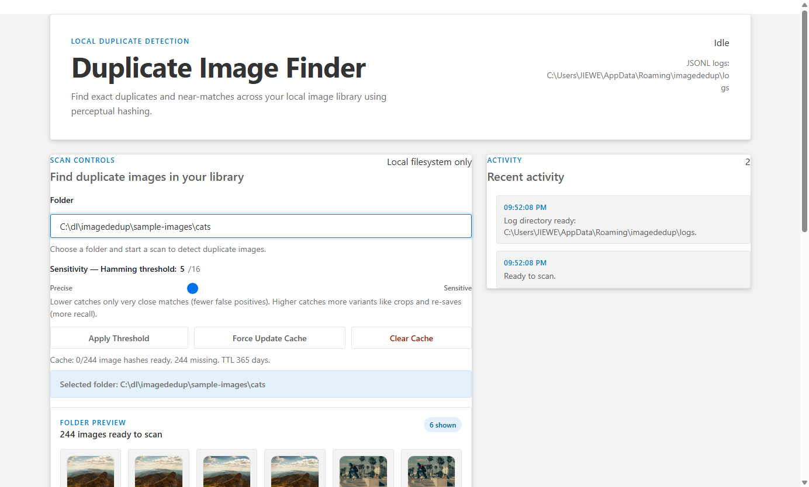
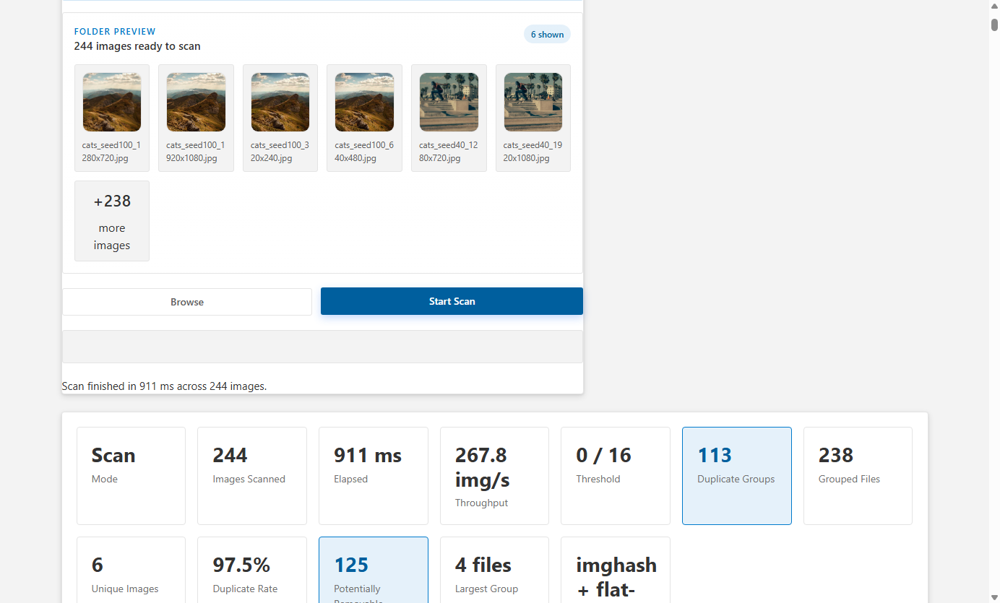
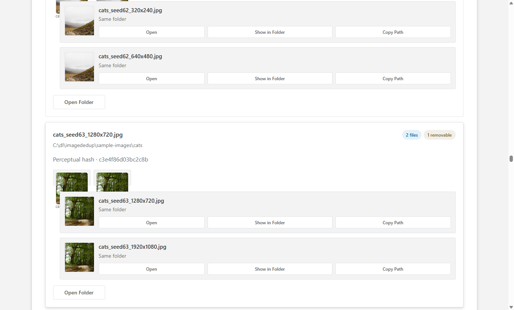
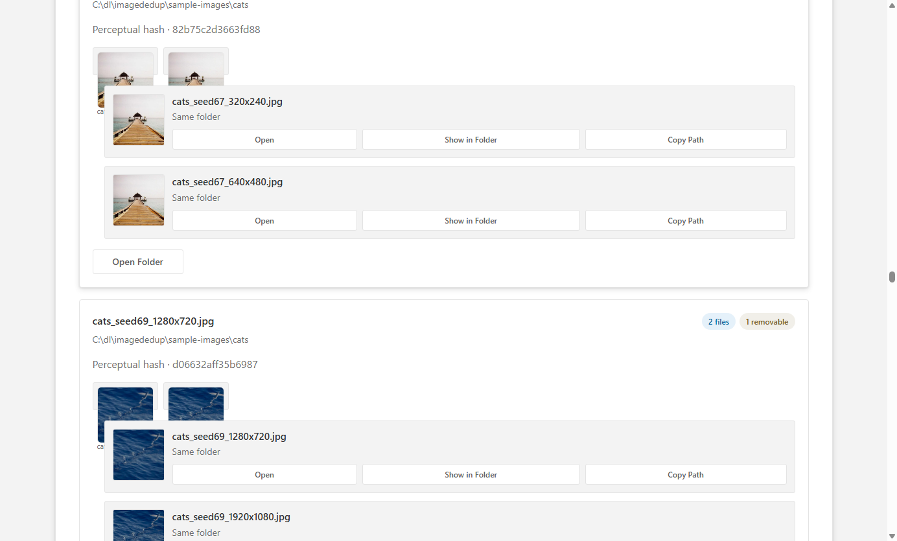
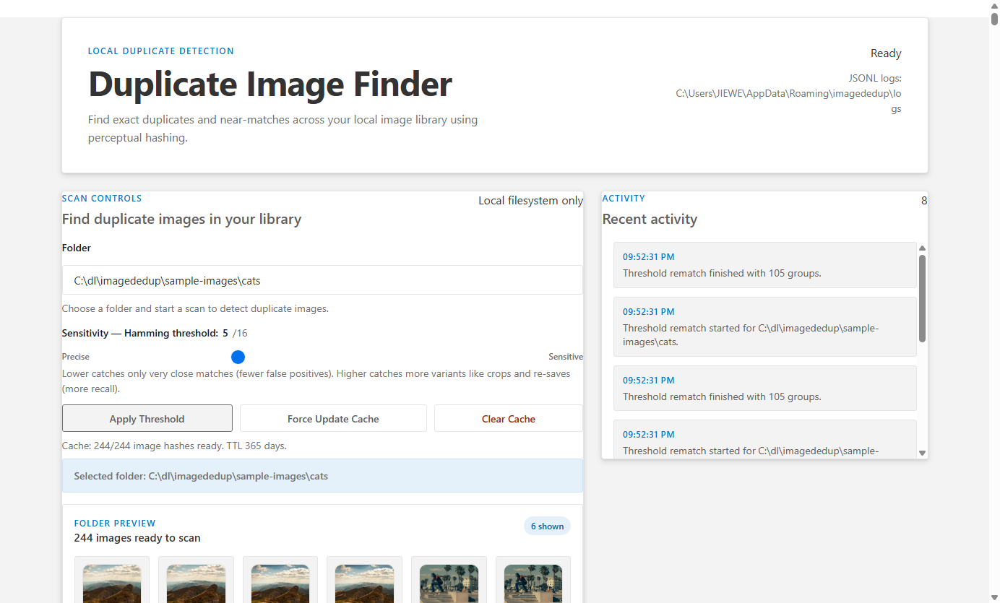
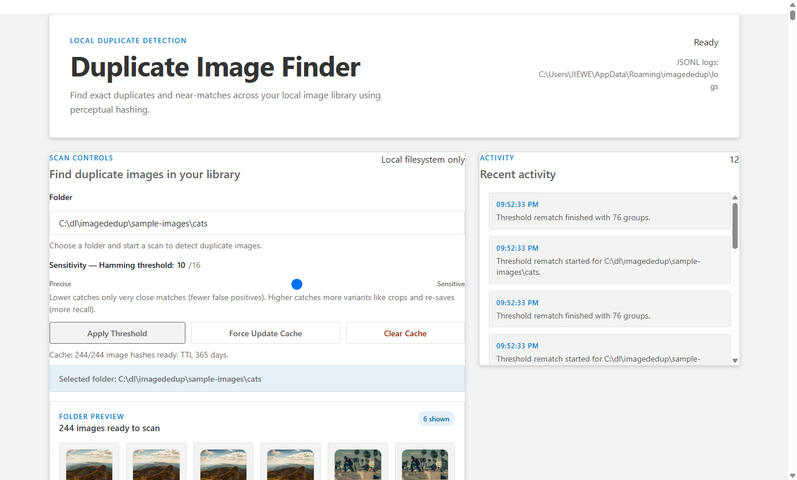
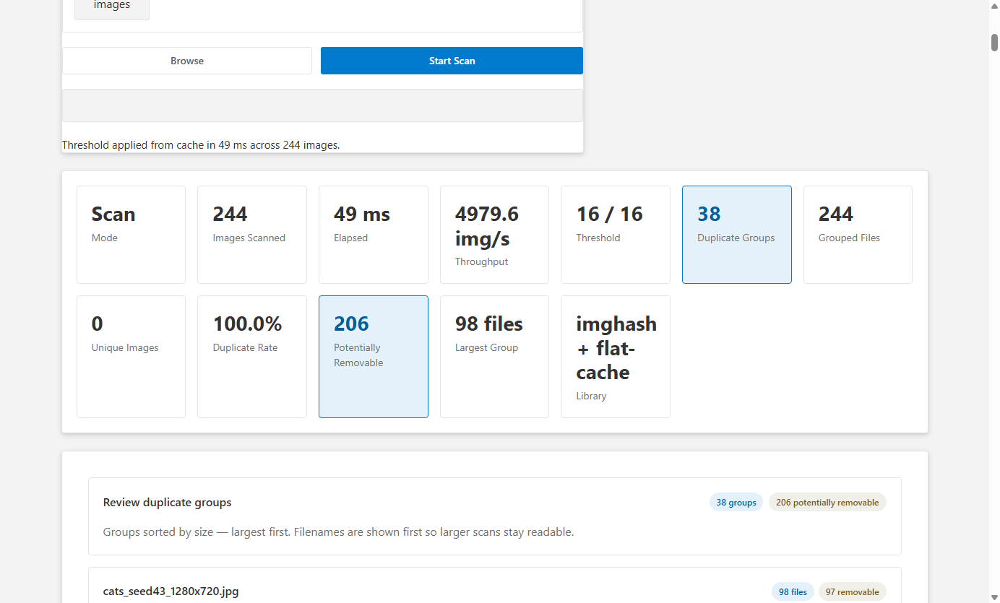

# ImageDedup

ImageDedup is a local Electron desktop app for finding duplicate and near-duplicate images in a folder. All processing happens on-device — no files leave your machine.

## Walkthrough

### 1. Pick a folder

Point the app at any folder. A live preview thumbnails a sample of images and shows the total count. The Hamming threshold slider — **Precise → Sensitive** — controls how similar two images must be to count as duplicates.



### 2. Start the scan

Click **Start Scan**. Hashing, rotation detection, and near-duplicate matching run in a streaming pipeline — partial results appear while the scan is still in flight.


### 3. Review the summary

When the scan finishes a stat grid shows images scanned, elapsed time, throughput, duplicate groups found, files that could be removed, and the current threshold.



### 4. Inspect duplicate groups

Each group shows side-by-side thumbnails, the shared perceptual hash, file names, and per-file actions (**Open**, **Show in Folder**, **Copy Path**). Groups are sorted largest-first.



### 5. Tune the Hamming threshold

The threshold slider changes how aggressively near-matches are detected — no re-scan needed after the first run because hashes are cached. Click **Apply Threshold** to re-match instantly from the cached hashes.

| Threshold | What it catches | Typical use |
|---|---|---|
| **0** | Pixel-identical files only | Finding exact copies |
| **5** *(default)* | Resized or lightly re-compressed versions | General cleanup |
| **10** | Crops, brightness edits, JPEG re-saves | Aggressive deduplication |
| **16** | Very loose perceptual similarity | Maximum recall, more false positives |

**Threshold 0 — exact duplicates only (113 groups):**



**Threshold 5 — near-duplicates included (default):**



**Threshold 10 — crops and re-saves caught:**



**Threshold 16 — maximum sensitivity (38 groups, 244 grouped files, 100% duplicate rate):**



---

## How It Works

### 1. Image Discovery

[`fast-glob`](https://github.com/mrmlnc/fast-glob) streams image files (PNG, JPEG, BMP, GIF, WebP, TIFF) from the chosen folder recursively as an async iterable. Discovery, hashing, and matching run concurrently in a pipeline bounded by a semaphore sized at `min(2 × CPU cores, 16)` so large folders begin surfacing results immediately.

### 2. Perceptual Hashing (pHash / DCT Hash)

Each image is preprocessed once by [`sharp`](https://sharp.pixelplumbing.com/):

- Decoded from any supported format
- Resized to **32 × 32** pixels (`fit: fill`)
- Converted to **grayscale** (single-channel raw pixel buffer)

A **2D Discrete Cosine Transform (DCT)** is then applied to the 32 × 32 pixel grid using a precomputed cosine lookup table. The implementation uses a separable two-pass approach — row DCT first, then column DCT — reducing multiply-adds from the naïve O(H²N²) = 65 536 to O(HN² + H²N) ≈ 10 240 (roughly 6× faster).

The **top-left 8 × 8 block** of DCT coefficients captures the low-frequency energy that characterises the image structure independently of minor colour or contrast adjustments. The mean of the 63 non-DC coefficients is computed, and each coefficient is compared to the mean to emit one bit, producing a **64-bit (16 hex character) perceptual hash**.

Two images with a Hamming distance ≤ the configured threshold (default **5 bits** out of 64) are considered near-duplicates. The threshold is adjustable in the UI or via the `IMAGEDEDUP_FASTPASS_HAMMING_THRESHOLD` environment variable.

### 3. Rotation Detection

The 32 × 32 pixel buffer is rotated **in-memory** at 0°, 90°, 180°, and 270° and a pHash is computed for each orientation. Storing up to four hashes per image lets the detector match duplicates that were rotated before saving.

### 4. Near-Duplicate Indexing — Multi-Index Hashing (MIH)

A naïve approach would compare every new hash against all indexed hashes — O(N) per image. Instead, ImageDedup uses a **Multi-Index Hashing (MIH)** index:

- Each 64-bit hash is split into **4 × 16-bit chunks**.
- **Pigeonhole principle**: if two hashes differ by ≤ T bits across 4 chunks, at least one chunk must match within ⌊T/4⌋ bits.
- For the default threshold of 5 bits: ⌊5/4⌋ = 1 bit per chunk — only **17 XOR masks** need to be probed per chunk.
- The full 64-bit Hamming distance is then verified for each candidate, making the effective query cost **O(1) regardless of index size**.

A **BK-tree** (Burkhard-Keller tree) is also implemented as an alternative metric-space index; it provides O(log N) average-case insert/query using Hamming distance as the metric.

### 5. Union-Find Grouping

Duplicate relationships are transitive: if A ≈ B and B ≈ C, then {A, B, C} form one group. A **path-compressed union-find** (disjoint-set) structure merges groups as each match is found, producing the final list of duplicate clusters in O(α(N)) ≈ O(1) per merge.

### 6. Streaming Partial Results

Partial duplicate groups are emitted to the UI **every ≥ 500 ms** so results appear incrementally during long scans rather than all at once at the end.

---

## OSS Modules

### Runtime

| Package | Role |
|---|---|
| [`electron`](https://www.electronjs.org/) | Cross-platform desktop shell (Chromium renderer + Node.js main process) |
| [`sharp`](https://sharp.pixelplumbing.com/) | High-performance image decoding, resizing, and grayscale conversion powered by libvips |
| [`fast-glob`](https://github.com/mrmlnc/fast-glob) | Fast recursive glob with async streaming; discovers image files as they are found |
| [`@awesome.me/webawesome`](https://backers.webawesome.com/) | Web component UI library; provides buttons, icons, cards, progress indicators, and the phase stepper |
| [`zod`](https://zod.dev/) | TypeScript-first schema validation; validates IPC message payloads at the main/renderer boundary |

### Development

| Package | Role |
|---|---|
| [`typescript`](https://www.typescriptlang.org/) | Static typing across main, renderer, and shared code |
| [`vite`](https://vite.dev/) | Renderer bundler |
| [`vitest`](https://vitest.dev/) | Unit and performance test runner |
| [`@playwright/test`](https://playwright.dev/) | End-to-end Electron testing |
| [`eslint`](https://eslint.org/) | Static analysis |
| [`electron-builder`](https://www.electron.build/) | Cross-platform packaging: NSIS installer, portable `.exe`, AppImage |
| [`jsdom`](https://github.com/jsdom/jsdom) | DOM environment for unit tests |
| [`@testing-library/dom`](https://testing-library.com/docs/dom-testing-library/intro/) | DOM querying and event utilities for unit tests |

---

## Commands

- `.\init.ps1`: install npm dependencies and the Playwright Chromium browser.
- `.\build.ps1`: build release artifacts for the current platform into `release`.
- `npm run release:win`: build Windows `nsis` installer and portable `.exe` artifacts into `release`.
- `npm run release:linux`: build a Linux `AppImage` executable into `release`.
- `npm run package:dir`: build an unpacked app directory into `release` for local inspection.
- `.\start.ps1`: build and run the desktop app.
- `npm test`: lint, unit tests, e2e tests, performance tests, and coverage gate.

`build.ps1` and `tools/Build-Release.ps1` also accept `-Target dir|linux|win|release`.

Windows release builds generally need to run on Windows, or on Linux with the Wine toolchain installed so `electron-builder` can emit `.exe` targets.

## Installing Without Trusting a Downloaded Executable

ImageDedup is published as an npm package as well as platform executable artifacts. If you do not want to run a downloaded `.exe`, install or inspect the npm package instead:

```powershell
npm view imagededup
npm pack imagededup --dry-run
npx imagededup
```

The npm package includes a Node launcher, the built app, TypeScript source, docs, and project configuration needed to inspect how the release was made. Release tags are built in GitHub Actions, and npm publishes use provenance so the package can be tied back to the release workflow.

To build from source:

```powershell
git clone https://github.com/gzprogergmail/imagededup.git
cd imagededup
npm ci
npm run build
npm test
npm run package:dir
```

For executable artifacts from GitHub Releases, prefer artifacts attached to tagged releases and compare them with the release workflow output. The release workflow also publishes SHA256 checksum sidecars and scans packaged artifacts with ClamAV before creating the draft GitHub Release.

## Project Layout

- `src/main`: Electron main process, IPC, and duplicate-detection services.
- `src/renderer`: renderer HTML, CSS, and DOM logic.
- `src/shared`: shared types and utility structures.
- `tests`: unit, e2e, and performance suites.
- `tools`: PowerShell maintenance helpers.
- `skills`: maintenance instructions for future Codex sessions.

More detail lives in [docs/architecture.md](docs/architecture.md) and [docs/testing.md](docs/testing.md).
